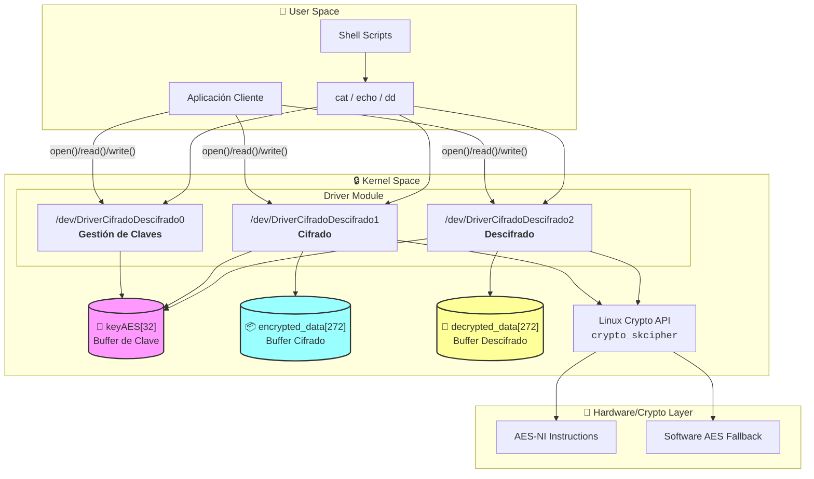
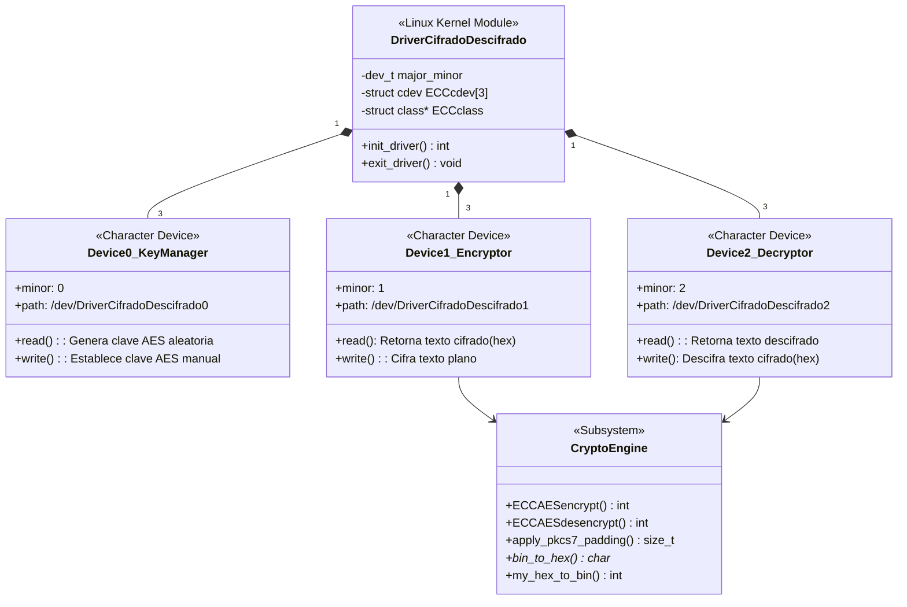
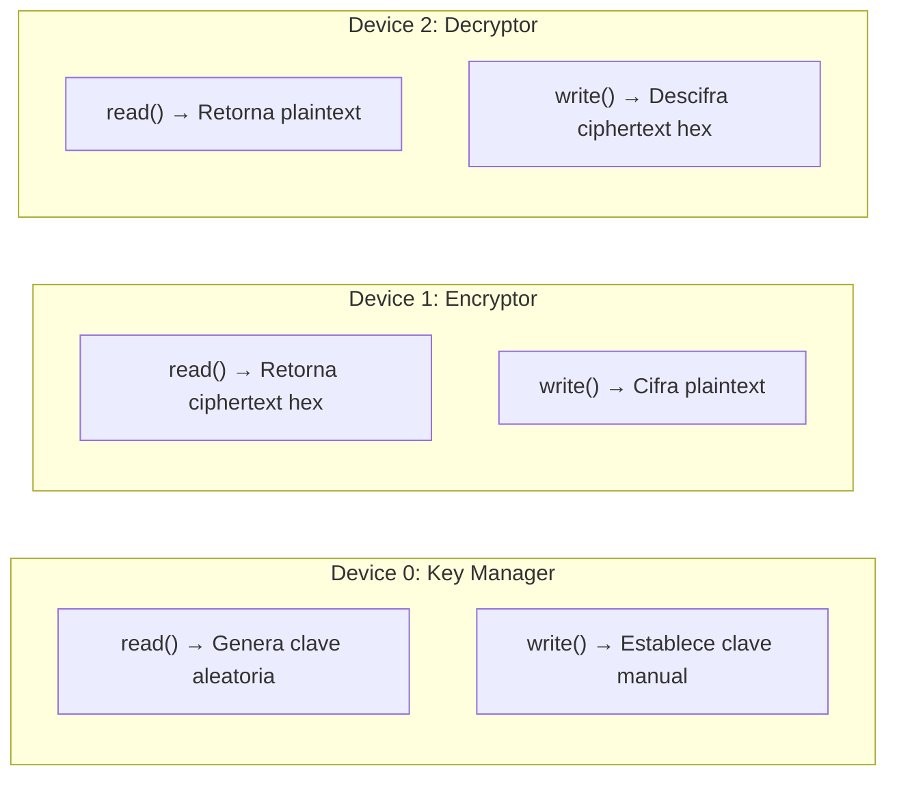

<div align="center">

# 🔐 DriverCifradoDescifrado


**Driver de Kernel Linux para Cifrado Simétrico AES-256 con Modo ECB**

*Implementación de bajo nivel para operaciones criptográficas de alto rendimiento a nivel de kernel*

---

[Arquitectura](#-arquitectura-del-driver) • [Instalación](#-instalación-y-compilación) • [Uso](#-guía-de-uso) • [API](#-api-de-dispositivos) • [Internos](#-lógica-interna-core-logic)

</div>

---

## 📋 Tabla de Contenidos

- [El Problema que Resuelve](#-el-problema-que-resuelve-the-why)
- [Arquitectura del Driver](#-arquitectura-del-driver)
- [Tech Stack](#-tech-stack)
- [Prerrequisitos](#-prerrequisitos)
- [Instalación y Compilación](#-instalación-y-compilación)
- [Guía de Uso](#-guía-de-uso)
- [API de Dispositivos](#-api-de-dispositivos)
- [Estructura del Proyecto](#-estructura-del-proyecto)
- [Consideraciones de Seguridad](#-consideraciones-de-seguridad)
- [Depuración](#-depuración)

---

## 🎯 El Problema que Resuelve (The Why)

### El Desafío

Las aplicaciones de espacio de usuario que requieren cifrado simétrico enfrentan varios problemas:

| Problema | Impacto |
|----------|---------|
| **Overhead de Context Switch** | Cada llamada criptográfica desde userspace implica transiciones costosas al kernel |
| **Gestión de Claves Insegura** | Las claves AES en memoria de usuario son vulnerables a ataques de memory dumping |
| **Latencia en Operaciones Batch** | Cifrar/descifrar múltiples bloques requiere múltiples syscalls |
| **Complejidad de Integración** | Las librerías de cifrado añaden dependencias y complejidad al build |

### La Solución

Este driver proporciona una **interfaz de dispositivo de caracteres** (`/dev/DriverCifradoDescifrado*`) que:

- ✅ **Ejecuta operaciones criptográficas en kernel space** reduciendo overhead
- ✅ **Mantiene las claves en memoria protegida del kernel** inaccesible desde userspace
- ✅ **Utiliza la API Crypto nativa de Linux** (`linux/crypto.h`) para máximo rendimiento
- ✅ **Expone una interfaz simple de archivos** (read/write) compatible con cualquier lenguaje

---

## 🏗 Arquitectura del Driver

### Diagrama de Arquitectura de Alto Nivel



### Arquitectura de Multi-Dispositivos

El driver implementa **3 dispositivos de caracteres independientes**, cada uno con responsabilidades específicas:



---

## 🛠 Tech Stack

### Dependencias del Kernel

| Componente | Header | Propósito |
|------------|--------|-----------|
| **Module Framework** | `<linux/module.h>` | Infraestructura base para módulos del kernel |
| **Kernel Printing** | `<linux/kernel.h>` | Funciones `pr_info()`, `pr_err()` para logging |
| **Character Types** | `<linux/ctype.h>` | Manipulación de caracteres |
| **Character Device** | `<linux/cdev.h>` | Registro de dispositivos de caracteres |
| **Memory Allocation** | `<linux/slab.h>` | `kmalloc()`, `kfree()` para memoria dinámica |
| **Virtual Filesystem** | `<linux/fs.h>` | `file_operations` y manejo de archivos |
| **Crypto Core** | `<linux/crypto.h>` | API criptográfica del kernel |
| **Scatter-Gather** | `<linux/scatterlist.h>` | Buffers para operaciones DMA/crypto |
| **Symmetric Cipher** | `<crypto/skcipher.h>` | API para cifrado simétrico (AES) |

### Especificaciones Criptográficas

```
┌─────────────────────────────────────────────────────────────┐
│                    CONFIGURACIÓN AES                        │
├─────────────────────────────────────────────────────────────┤
│  Algoritmo:        AES (Advanced Encryption Standard)       │
│  Tamaño de Clave:  256 bits (32 bytes)                      │
│  Modo de Operación: ECB (Electronic Codebook)               │
│  Tamaño de Bloque: 128 bits (16 bytes)                      │
│  Padding:          PKCS#7                                   │
│  Formato Salida:   Hexadecimal (uppercase)                  │
└─────────────────────────────────────────────────────────────┘
```

> ⚠️ **Nota sobre ECB**: Se utiliza el modo ECB por simplicidad educativa. Este modo **no es recomendado para producción** ya que bloques idénticos de texto plano producen bloques idénticos de texto cifrado, revelando patrones. Para uso real, considere CBC o GCM.

---

## 📦 Prerrequisitos

### Sistema Operativo

- **Kernel Linux** ≥ 4.x (probado en kernel 5.x+)
- Soporte para módulos cargables habilitado (`CONFIG_MODULES=y`)
- API Crypto del kernel habilitada (`CONFIG_CRYPTO=y`, `CONFIG_CRYPTO_AES=y`)

### Herramientas de Desarrollo

```bash
# Verificar herramientas necesarias
which make gcc       # Build tools
ls /lib/modules/$(uname -r)/build  # Kernel headers

# Debian/Ubuntu
sudo apt-get install build-essential linux-headers-$(uname -r)

# Fedora/RHEL/CentOS
sudo dnf install kernel-devel kernel-headers gcc make

# Arch Linux
sudo pacman -S linux-headers base-devel
```

### Permisos

- Acceso root (sudo) para `insmod`/`rmmod`
- Permisos de escritura en `/dev/` o uso de `chmod`

---

## 🚀 Instalación y Compilación

### Método Rápido (Script Automatizado)

```bash
# Clonar el repositorio
git clone https://github.com/Rubenpg4/DriverCifradoSimetrico.git
cd DriverCifradoSimetrico

# Compilar, cargar driver y configurar permisos
sudo ./make.sh
```

### Método Manual (Paso a Paso)

<details>
<summary><b>📋 Expandir instrucciones detalladas</b></summary>

#### Paso 1: Limpiar compilaciones anteriores

```bash
make clean
```

#### Paso 2: Compilar el módulo

```bash
make
```

**Salida esperada:**
```
make -C /lib/modules/5.15.0-generic/build M=/path/to/DriverCifradoSimetrico modules
make[1]: Entering directory '/usr/src/linux-headers-5.15.0-generic'
  CC [M]  /path/to/DriverCifradoSimetrico/DriverCifradoDescifrado.o
  MODPOST /path/to/DriverCifradoSimetrico/Module.symvers
  CC [M]  /path/to/DriverCifradoSimetrico/DriverCifradoDescifrado.mod.o
  LD [M]  /path/to/DriverCifradoSimetrico/DriverCifradoDescifrado.ko
```

#### Paso 3: Descargar módulo anterior (si existe)

```bash
sudo rmmod DriverCifradoDescifrado 2>/dev/null || true
```

#### Paso 4: Cargar el módulo

```bash
sudo insmod DriverCifradoDescifrado.ko
```

#### Paso 5: Verificar carga exitosa

```bash
lsmod | grep DriverCifrado
# Salida: DriverCifradoDescifrado    16384  0
```

#### Paso 6: Configurar permisos de acceso

```bash
sudo chmod 666 /dev/DriverCifradoDescifrado*
```

#### Paso 7: Verificar dispositivos creados

```bash
ls -la /dev/DriverCifradoDescifrado*
# crw-rw-rw- 1 root root 234, 0 Jan 22 00:00 /dev/DriverCifradoDescifrado0
# crw-rw-rw- 1 root root 234, 1 Jan 22 00:00 /dev/DriverCifradoDescifrado1
# crw-rw-rw- 1 root root 234, 2 Jan 22 00:00 /dev/DriverCifradoDescifrado2
```

</details>

### Verificar Instalación

```bash
# Ver logs del kernel para confirmar inicialización
dmesg | tail -n 10
```

**Salida esperada:**
```
[12345.678901] DriverCifradoDescifrado driver assigned 234 major number
[12345.678902] /sys/class/DriverCifradoDescifradoClass class driver registered
[12345.678903] Device node /dev/DriverCifradoDescifrado0 created
[12345.678904] Device node /dev/DriverCifradoDescifrado1 created
[12345.678905] Device node /dev/DriverCifradoDescifrado2 created
[12345.678906] ECC driver initialized and loaded
```

---

## 📖 Guía de Uso

### Quick Start: Cifrado y Descifrado Completo

```bash
# 1. Generar clave AES aleatoria
cat /dev/DriverCifradoDescifrado0

# 2. Cifrar un mensaje
echo -n "Mensaje secreto" > /dev/DriverCifradoDescifrado1

# 3. Leer el texto cifrado (hexadecimal)
cat /dev/DriverCifradoDescifrado1
# Salida: 4a8f2c3d... (hex)

# 4. Descifrar el mensaje
echo -n "4a8f2c3d..." > /dev/DriverCifradoDescifrado2

# 5. Leer texto descifrado
cat /dev/DriverCifradoDescifrado2
# Salida: Mensaje secreto
```

### Ejemplos Avanzados

<details>
<summary><b>🔑 Uso con Clave Personalizada</b></summary>

```bash
# Establecer una clave AES-256 específica (exactamente 32 caracteres)
echo -n "MiClaveSecreta32BytesExactamente" > /dev/DriverCifradoDescifrado0

# Verificar en dmesg
dmesg | tail -n 1
# [xxxxx.xxxxxx] Clave AES establecida con exito: MiClaveSecreta32BytesExactamente
```

> ⚠️ **Importante**: La clave debe tener **exactamente 32 bytes** para AES-256.

</details>

<details>
<summary><b>📂 Cifrar Contenido de un Archivo</b></summary>

```bash
# Crear archivo de prueba
echo "Contenido confidencial del archivo" > archivo_secreto.txt

# Cifrar (max 256 bytes)
cat archivo_secreto.txt > /dev/DriverCifradoDescifrado1

# Guardar texto cifrado
cat /dev/DriverCifradoDescifrado1 > archivo_cifrado.hex

# Verificar
cat archivo_cifrado.hex
```

</details>

<details>
<summary><b>🔄 Pipeline de Cifrado/Descifrado</b></summary>

```bash
#!/bin/bash
# Script completo de cifrado/descifrado

DEVICE_KEY="/dev/DriverCifradoDescifrado0"
DEVICE_ENC="/dev/DriverCifradoDescifrado1"
DEVICE_DEC="/dev/DriverCifradoDescifrado2"

# Generar clave
cat $DEVICE_KEY

# Cifrar
MENSAJE="Este es mi mensaje ultrasecreto"
echo -n "$MENSAJE" > $DEVICE_ENC

# Obtener cifrado
CIFRADO=$(cat $DEVICE_ENC)
echo "Cifrado: $CIFRADO"

# Descifrar
echo -n "$CIFRADO" > $DEVICE_DEC

# Obtener descifrado
DESCIFRADO=$(cat $DEVICE_DEC)
echo "Descifrado: $DESCIFRADO"

# Verificar integridad
if [ "$MENSAJE" == "$DESCIFRADO" ]; then
    echo "✅ Verificación exitosa!"
else
    echo "❌ Error de integridad"
fi
```

</details>

---

## 📡 API de Dispositivos

### Mapa de Operaciones



### Referencia Completa de la API

#### `/dev/DriverCifradoDescifrado0` — Gestión de Claves

| Operación | Syscall | Descripción | Retorno |
|-----------|---------|-------------|---------|
| **Leer** | `read()` | Genera una nueva clave AES-256 aleatoria usando `get_random_bytes()` | `0` (clave generada en kernel) |
| **Escribir** | `write()` | Establece una clave AES-256 proporcionada por el usuario | Número de bytes escritos o `-EINVAL` si longitud ≠ 32 |

#### `/dev/DriverCifradoDescifrado1` — Cifrado

| Operación | Syscall | Descripción | Retorno |
|-----------|---------|-------------|---------|
| **Leer** | `read()` | Lee el último mensaje cifrado en formato hexadecimal | Bytes leídos, `0` si no hay datos |
| **Escribir** | `write()` | Cifra el texto plano proporcionado (max 256 bytes) | Bytes procesados o `-EINVAL` |

#### `/dev/DriverCifradoDescifrado2` — Descifrado

| Operación | Syscall | Descripción | Retorno |
|-----------|---------|-------------|---------|
| **Leer** | `read()` | Lee el último mensaje descifrado | Bytes leídos, `0` si no hay datos |
| **Escribir** | `write()` | Descifra el texto cifrado (hex) proporcionado | Bytes procesados o `-EINVAL` |

### Códigos de Error

| Código | Constante | Causa |
|--------|-----------|-------|
| `-EFAULT` | `EFAULT` | Error al copiar datos entre kernel y userspace |
| `-EINVAL` | `EINVAL` | Longitud de clave incorrecta (≠32) o mensaje muy largo (>256) |
| `-ENODEV` | `ENODEV` | Minor number de dispositivo inválido |
| `-ENOMEM` | `ENOMEM` | No se pudo asignar memoria en kernel |
| `-EAGAIN` | `EAGAIN` | Error al configurar la clave en el algoritmo |

---

## 📁 Estructura del Proyecto

```
DriverCifradoSimetrico/
├── 📄 DriverCifradoDescifrado.c    # Código fuente principal del módulo
│   ├── Constantes y buffers globales
│   ├── Funciones de utilidad (hex/bin conversion)
│   ├── generate_aes_key()          # Generador de claves CSPRNG
│   ├── apply_pkcs7_padding()       # Padding PKCS#7
│   ├── ECCAESencrypt()             # Motor de cifrado AES-ECB
│   ├── ECCAESdesencrypt()          # Motor de descifrado AES-ECB
│   ├── File operations (open/read/write/release)
│   ├── init_driver()               # Inicialización del módulo
│   └── exit_driver()               # Limpieza del módulo
│
├── 📄 Makefile                     # Build system para módulos del kernel
│   ├── obj-m: Objeto a compilar
│   ├── all: Compila contra headers del kernel actual
│   └── clean: Limpia artefactos de compilación
│
├── 📜 make.sh                      # Script de despliegue automatizado
│   ├── Limpia y recompila
│   ├── Descarga/carga el módulo
│   ├── Configura permisos (chmod 666)
│   └── Muestra logs recientes
│
├── 📜 readKernel.sh                # Script de prueba rápida
│   ├── Genera clave
│   ├── Cifra mensaje de ejemplo
│   └── Muestra logs del kernel
│
└── 📖 README.md                    # Esta documentación
```

---

## 🔒 Consideraciones de Seguridad

### ⚠️ Limitaciones Conocidas

| Aspecto | Estado | Descripción |
|---------|--------|-------------|
| **Modo ECB** | ⚠️ Inseguro | Bloques idénticos producen cifrados idénticos. Usar solo para educación. |
| **No hay IV** | ⚠️ Limitado | Sin vector de inicialización, falta protección contra replay. |
| **Clave en Memoria** | ✅ Kernel | La clave reside en memoria del kernel, no accesible desde userspace. |
| **Permisos 666** | ⚠️ Revisar | Cualquier usuario puede cifrar/descifrar. Ajustar según necesidad. |
| **Sin autenticación** | ❌ Falta | No hay MAC/HMAC para verificar integridad. |

### Recomendaciones para Producción

1. **Usar CBC o GCM** en lugar de ECB
2. **Implementar MAC** para integridad de mensajes
3. **Restringir permisos** (`chmod 600` + grupo específico)
4. **Rotar claves** periódicamente
5. **Limpiar buffers** después de uso (`memset` a cero)

---

## 🐛 Depuración

### Comandos Útiles

```bash
# Ver logs del kernel en tiempo real
sudo dmesg -wH

# Filtrar solo logs del driver
dmesg | grep -E "(ECC|AES|Cifrado|Descifrado)"

# Verificar estado del módulo
lsmod | grep Driver
cat /proc/modules | grep Driver

# Ver información del dispositivo
ls -la /dev/DriverCifradoDescifrado*
cat /sys/class/DriverCifradoDescifradoClass/DriverCifradoDescifrado*/dev

# Descargar módulo forzosamente
sudo rmmod -f DriverCifradoDescifrado
```

### Mensajes de Log Comunes

| Mensaje | Significado |
|---------|-------------|
| `Clave AES generada: ...` | Clave creada exitosamente |
| `Cifrado exitoso. Datos cifrados en hexadecimal: ...` | Mensaje cifrado correctamente |
| `Descifrado exitoso. Datos descifrados: ...` | Mensaje descifrado correctamente |
| `La longitud de la clave debe ser de 32 bytes` | Clave proporcionada tiene longitud incorrecta |
| `El mensaje es demasiado largo` | Mensaje excede 256 bytes |

---

## 📜 Licencia

Este proyecto está licenciado bajo la **GNU General Public License v2 (GPL-2.0)**, como es requerido para módulos del kernel Linux.

```
MODULE_LICENSE("GPL");
```

---

<div align="center">

**[⬆ Volver al inicio](#-drivercifradodescifrado)**

*Desarrollado con 🔐 para la comunidad de sistemas embebidos y seguridad informática*

</div>
